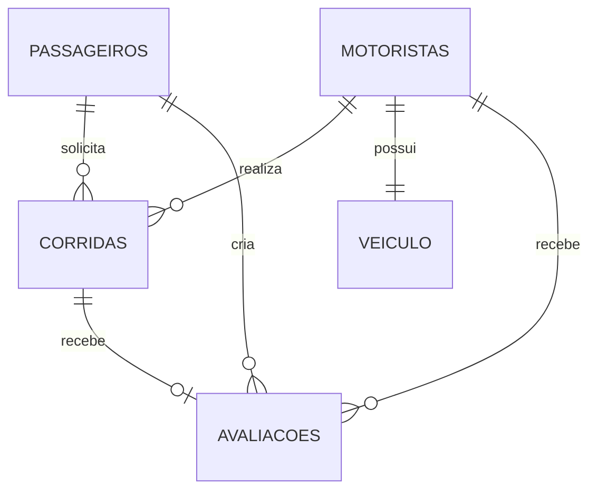

# CHECKPOINT 1 — Projeto Bora Lá

**Disciplina:** Banco de Dados NoSQL  
**Curso:** Tecnologia em Sistemas para Internet — UTFPR Guarapuava  
**Integrante:** Péricles Expedito Andrade  
**Projeto:** Bora Lá — Sistema de corridas

---

## 1. Tema e Escopo do Sistema

O **Bora Lá** é um sistema web simples para solicitação de corridas. A ideia é permitir que um passageiro faça seu cadastro, informe o local de origem e o destino e solicite uma corrida. Os motoristas já estarão cadastrados no sistema e poderão aceitar as corridas disponíveis.

Os principais usuários são os passageiros e os motoristas. Para não deixar o projeto muito grande, o sistema não terá pagamento online, chat, cupons ou rastreamento em tempo real. O foco será no fluxo principal da corrida: solicitar, aceitar, iniciar, finalizar e depois permitir uma avaliação.

O MongoDB foi escolhido porque permite armazenar informações relacionadas dentro do mesmo documento. Por exemplo, origem e destino podem ficar dentro da própria corrida e os dados do veículo podem ficar dentro do motorista. Passageiros e motoristas serão referenciados por ID nas corridas.

---

## 2. Entidades e Coleções

O projeto terá quatro coleções: `passageiros`, `motoristas`, `corridas` e `avaliacoes`.

### 2.1 Passageiros

| Campo | Tipo BSON | Descrição |
|---|---|---|
| `_id` | ObjectId | Identificador do passageiro |
| `nome` | String | Nome do passageiro |
| `email` | String | E-mail utilizado no cadastro |
| `senha_hash` | String | Senha armazenada de forma protegida |
| `telefone` | String | Telefone para contato |
| `ativo` | Boolean | Informa se a conta está ativa |
| `data_cadastro` | Date | Data de cadastro |

O campo `email` terá índice único para evitar dois passageiros com o mesmo e-mail.

### 2.2 Motoristas

| Campo | Tipo BSON | Descrição |
|---|---|---|
| `_id` | ObjectId | Identificador do motorista |
| `nome` | String | Nome do motorista |
| `telefone` | String | Telefone |
| `cnh` | String | Número da CNH |
| `disponivel` | Boolean | Informa se está disponível para corrida |
| `veiculo` | Subdocumento | Dados do veículo |
| `veiculo.marca` | String | Marca |
| `veiculo.modelo` | String | Modelo |
| `veiculo.placa` | String | Placa |
| `veiculo.cor` | String | Cor |
| `data_cadastro` | Date | Data de cadastro |

Os campos `cnh` e `veiculo.placa` terão índice único.

### 2.3 Corridas

| Campo | Tipo BSON | Descrição |
|---|---|---|
| `_id` | ObjectId | Identificador da corrida |
| `passageiro_id` | ObjectId | Referência ao passageiro |
| `motorista_id` | ObjectId ou Null | Referência ao motorista |
| `origem` | Subdocumento | Informações da origem |
| `origem.endereco` | String | Endereço de origem |
| `origem.coordenadas` | Array de Number | Longitude e latitude |
| `destino` | Subdocumento | Informações do destino |
| `destino.endereco` | String | Endereço de destino |
| `destino.coordenadas` | Array de Number | Longitude e latitude |
| `distancia_estimada_km` | Number | Distância estimada |
| `tempo_estimado_minutos` | Number | Tempo estimado |
| `valor_estimado` | Number | Valor estimado |
| `valor_final` | Number ou Null | Valor final |
| `status` | String | Status atual da corrida |
| `corrida_ativa` | Boolean | Informa se a corrida ainda está ativa |
| `data_solicitacao` | Date | Data da solicitação |
| `data_aceite` | Date ou Null | Data do aceite |
| `data_finalizacao` | Date ou Null | Data da finalização |
| `historico_status` | Array de Subdocumentos | Mudanças de status da corrida |

Serão criados índices nos campos `status`, `passageiro_id`, `motorista_id` e `valor_estimado`, pois serão usados nas consultas da aplicação.

### 2.4 Avaliações

| Campo | Tipo BSON | Descrição |
|---|---|---|
| `_id` | ObjectId | Identificador da avaliação |
| `corrida_id` | ObjectId | Referência à corrida |
| `passageiro_id` | ObjectId | Passageiro que avaliou |
| `motorista_id` | ObjectId | Motorista avaliado |
| `nota` | Number | Nota de 1 a 5 |
| `comentario` | String | Comentário da avaliação |
| `data` | Date | Data da avaliação |

O campo `corrida_id` terá índice único para que uma corrida tenha no máximo uma avaliação neste projeto.

---

## 3. Embedding e Referencing

| Relação | Escolha | Justificativa |
|---|---|---|
| Motorista e veículo | Embedding | O veículo faz parte do cadastro do motorista e os dados normalmente serão mostrados juntos. |
| Corrida e origem | Embedding | A origem pertence somente àquela corrida e sempre será consultada junto com ela. |
| Corrida e destino | Embedding | O destino também pertence à corrida e será lido junto com os outros dados. |
| Corrida e histórico de status | Embedding | O histórico terá poucos estados e faz parte do acompanhamento da própria corrida. |
| Passageiro e corridas | Referencing | Um passageiro pode ter muitas corridas, então não é interessante guardar todas dentro do documento do passageiro. |
| Motorista e corridas | Referencing | Um motorista pode realizar muitas corridas durante o uso do sistema. |
| Corrida e passageiro | Referencing | O passageiro possui cadastro próprio e pode aparecer em várias corridas. |
| Corrida e motorista | Referencing | O motorista também possui cadastro próprio e pode participar de várias corridas. |
| Avaliação e corrida | Referencing | A avaliação fica em uma coleção separada e aponta para a corrida avaliada. |
| Avaliação e motorista | Referencing | Permite encontrar facilmente as avaliações recebidas por um motorista. |

As corridas não ficam armazenadas dentro do passageiro ou do motorista porque essa lista pode crescer continuamente. Usando referências, evitamos que esses documentos aumentem sem controle e se aproximem do limite de 16 MB do MongoDB. Já origem, destino, veículo e histórico de status possuem tamanho pequeno e controlado, por isso podem ficar embutidos.

---

## 4. Relacionamentos e Cardinalidade

| Entidade 1 | Entidade 2 | Cardinalidade |
|---|---|---|
| Passageiro | Corrida | 1:N |
| Motorista | Corrida | 1:N |
| Motorista | Veículo | 1:1 |
| Corrida | Avaliação | 1:0..1 |
| Passageiro | Avaliação | 1:N |
| Motorista | Avaliação | 1:N |
| Passageiro | Motorista | N:N (por meio de Corridas) |

A relação entre passageiros e motoristas é N:N ao longo do sistema: um passageiro pode realizar corridas com diferentes motoristas e um motorista pode atender diferentes passageiros. Essa relação é resolvida pela coleção `corridas`.



---

## 5. Exemplos de Documentos

### 5.1 Passageiro

```json
{
  "_id": "ObjectId(...)",
  "nome": "Péricles Andrade",
  "email": "pericles@borala.com",
  "senha_hash": "hash_pericles",
  "telefone": "42999990001",
  "ativo": true,
  "data_cadastro": "2026-08-20T12:00:00Z"
}
```

### 5.2 Motorista

```json
{
  "_id": "ObjectId(...)",
  "nome": "Carlos Souza",
  "telefone": "42988880001",
  "cnh": "PR123456701",
  "disponivel": true,
  "veiculo": {
    "marca": "Chevrolet",
    "modelo": "Onix",
    "placa": "ABC1D23",
    "cor": "Prata"
  },
  "data_cadastro": "2026-08-10T10:00:00Z"
}
```

### 5.3 Corrida

```json
{
  "_id": "ObjectId(...)",
  "passageiro_id": "ObjectId(...)",
  "motorista_id": null,
  "origem": {
    "endereco": "Centro, Guarapuava - PR",
    "coordenadas": [-51.4628, -25.3907]
  },
  "destino": {
    "endereco": "UTFPR Guarapuava",
    "coordenadas": [-51.4732, -25.3834]
  },
  "distancia_estimada_km": 5.8,
  "tempo_estimado_minutos": 12,
  "valor_estimado": 18.5,
  "valor_final": null,
  "status": "aguardando_motorista",
  "corrida_ativa": true,
  "data_solicitacao": "2026-09-16T21:00:00Z",
  "data_aceite": null,
  "data_finalizacao": null,
  "historico_status": [
    {
      "status": "solicitada",
      "data": "2026-09-16T21:00:00Z"
    },
    {
      "status": "aguardando_motorista",
      "data": "2026-09-16T21:00:02Z"
    }
  ]
}
```

### 5.4 Avaliação

```json
{
  "_id": "ObjectId(...)",
  "corrida_id": "ObjectId(...)",
  "passageiro_id": "ObjectId(...)",
  "motorista_id": "ObjectId(...)",
  "nota": 5,
  "comentario": "Motorista educado e corrida tranquila.",
  "data": "2026-09-15T17:40:00Z"
}
```

---

## 6. Consultas do Sistema

Foram definidas cinco consultas principais para alimentar telas e funções do sistema.

### 1. Corridas disponíveis

**Endpoint:** `GET /api/corridas/disponiveis`

Mostra as corridas que ainda estão com status `aguardando_motorista` e que não possuem motorista definido. Essa consulta será usada na tela do motorista.

### 2. Histórico do passageiro

**Endpoint:** `GET /api/corridas/passageiro/:id`

Busca todas as corridas feitas por um passageiro e ordena da mais recente para a mais antiga.

### 3. Histórico do motorista

**Endpoint:** `GET /api/corridas/motorista/:id`

Busca as corridas relacionadas a um determinado motorista.

### 4. Filtro de corridas

**Endpoint:** `GET /api/corridas/filtro?status=finalizada&valorMin=10&valorMax=30`

Permite buscar corridas por status e também por uma faixa de valor. Para a faixa de valor serão usados os operadores `$gte` e `$lte`.

### 5. Aceitar corrida

**Endpoint:** `PATCH /api/corridas/:id/aceitar`

Permite que um motorista aceite uma corrida que ainda esteja aguardando motorista. A atualização altera o motorista, o status e a data do aceite.

---

## 7. Dados Iniciais

O arquivo `init/mongo-init.js` cria 20 documentos para teste:

- 5 passageiros;
- 5 motoristas;
- 8 corridas;
- 2 avaliações.

As corridas usam referências por `ObjectId` para passageiros e motoristas.

---

## 8. Como executar

Para iniciar o ambiente:

```bash
./iniciar.sh
```

Para recriar o banco do zero:

```bash
./reset.sh
```

Depois é possível acessar:

- API: `http://localhost:3400`
- Health Check: `http://localhost:3400/api/health`
- Mongo Express: `http://localhost:8401`

O banco principal do projeto é `borala`.
